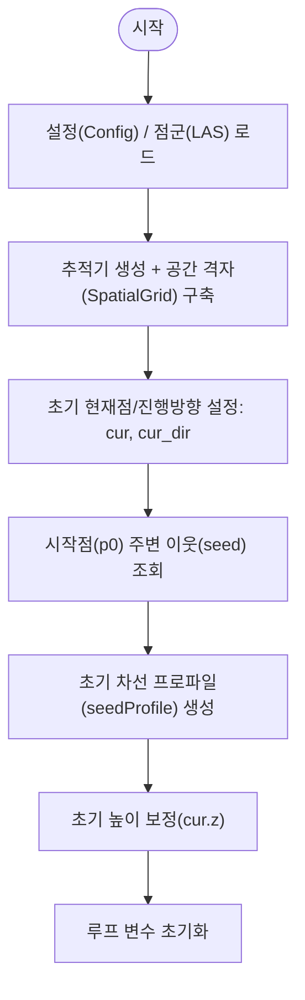
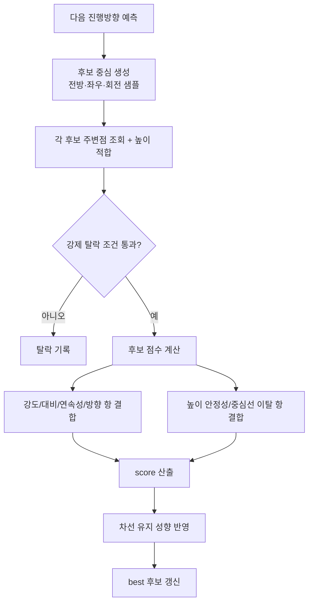
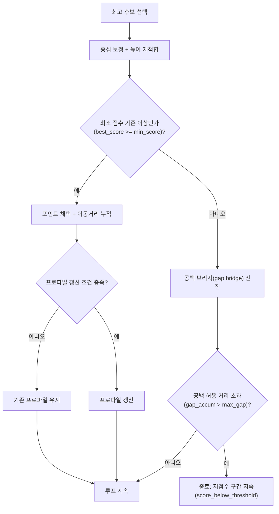
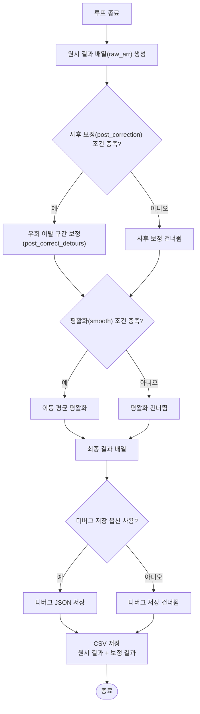

# lane_agent_project

MMS LAS 데이터에서 차선을 추적하는 Python 기반 룰형 에이전트 예제입니다.

## 입력
- LAS 파일
- 시작점 P0(x, y, z)
- 두 번째 점 P1(x, y, z)
- config.yaml

## 출력
- CSV(x, y, z)
- 선택: debug json

## 설치
```bash
pip install laspy numpy
```

## 실행
```bash
python -m lane_agent.cli \
  --las data/sample.las \
  --p0 314383.1 3899679.2 75.2 \
  --p1 314384.0 3899679.0 75.2 \
  --config config.yaml \
  --output lane_points.csv
```

## 구성
- `lane_agent/cli.py` : 실행 엔트리
- `lane_agent/config.py` : 설정 로드
- `lane_agent/las_io.py` : LAS xyz/intensity 로드
- `lane_agent/grid.py` : spatial grid
- `lane_agent/scoring.py` : 후보 점수 계산
- `lane_agent/agent.py` : 차선 추적 에이전트
- `lane_agent/csv_io.py` : 결과 저장

## 참고
현재 기본 파라미터는 실제 데이터 기반 튜닝 전의 시작값입니다. 따라서 `step_m`, `max_gap_m`, `search_half_width_m`, `min_score`는 실제 LAS에 맞춰 조정이 필요할 수 있습니다.


## 프로세스 요약
##### 입력 받기
###### CLI에서 LAS 경로, 시작점 p0, 방향 기준점 p1, 설정 파일, 출력 경로를 받고, config/LAS를 로드

##### 초기 준비
###### 에이전트가 전체 포인트를 공간 격자(SpatialGrid)로 인덱싱해서, 주변 점 탐색을 빠르게 할 준비

##### 시드(초기 차선 특성) 만들기
###### 시작점 주변에서 밝기/배경/높이 기준(SeedProfile)을 추정해 “어떤 점이 차선다운지” 기준을 만듬

##### 한 스텝씩 후보 생성 → 점수 평가 → 최적 선택
###### 매 스텝마다 전방/좌우 후보를 만들고, 하드 게이트(횡방향 이탈·Z 급변)로 먼저 거른 뒤, intensity/연속성/직진성/Z 안정성 등을 종합 점수로 평가해서 최고 후보를 선택

##### 보정 & 종료 판단
###### 선택된 점을 중심 보정(횡단면 기반 포함)하고, 점수가 낮으면 gap bridge로 잠깐 버티며 진행하다가 한계 초과 시 종료합니다. 충분히 좋으면 점을 확정하고 프로파일도 조금씩 업데이트

##### 후처리 후 저장
###### 추적 결과에 detour 보정/스무딩을 적용하고, raw/보정 결과 CSV와 디버그 JSON을 저장


## 전체 파이프라인 (상세)

### 1) 실행 인자 파싱 + 파일 로드
`cli.py`가 실행되면 `--las`, `--p0`, `--p1`, `--config`, `--output`을 받습니다.

- `load_config()`로 설정을 읽고, `load_las_xyz_intensity()`로 LAS의 `xyz + intensity`를 메모리에 올립니다.
- `p0`, `p1`는 `numpy` 배열로 변환됩니다.

---

### 2) 에이전트 초기화 + 빠른 주변 검색 구조 생성
`LaneTrackerAgent` 생성 시 전체 점군을 `SpatialGrid`로 인덱싱합니다.

- 이 격자는 “반경 내 점 찾기(`query_radius_xy`)”를 빠르게 하기 위한 구조입니다.
- 매 스텝마다 후보 주변점을 계속 조회하므로 성능 핵심입니다.

---

### 3) 시작점 기준 “차선 프로파일” 만들기
시작점 `p0` 주변 점을 모아 `SeedProfile`을 만듭니다.

이 프로파일은 아래 3가지로 구성됩니다.

- `target_intensity` (밝은 차선 기준)
- `background_intensity` (배경 기준)
- `z_ref` (높이 기준)

이후 후보 점수 계산의 기준선 역할을 합니다.

---

### 4) 추적 루프 시작: 방향 예측 → 후보 생성
루프는 `max_track_length_m`까지 반복됩니다.

- 현재까지의 점 이력을 보고 진행 방향을 예측합니다 (`_predict_direction`).
- 그 방향 기준으로 후보 중심들을 만듭니다.
  - 전방 거리(0.85~1.15배 `step`) × 좌우 오프셋 그리드
  - 소폭 헤딩 변화 후보(곡선 대응)

즉, “앞으로 어디가 차선일지”를 여러 가설로 생성합니다.

---

### 5) 후보별 1차 탈락(하드 게이트)
각 후보에 대해 먼저 “즉시 탈락 규칙”을 적용합니다.

- 예측 중심선에서 옆으로 너무 벗어나면 탈락
- 이전 점 대비 Z 변화가 너무 크면 탈락

이 단계는 점수 계산 전에 오탐을 강하게 차단합니다.

---

### 6) 후보 점수 계산(핵심 로직)
하드 게이트 통과 후보만 `score_candidate()`로 평가합니다.

주요 점수 요소:

- 밝기/대비 기반 점수 (`intensity_term`, `contrast_term`)
- 이전 스텝과 거리 연속성 (`continuity_term`)
- 방향 급변 억제 (`straight_term`)
- 높이 안정성 (`z_term`, `z_step_term`)
- 예측 중심선에서 횡방향 이탈 패널티 (`center_term`)

그리고 최근 궤적을 반영한 `lane_loyalty`를 곱해 “지금까지 따라오던 차선”을 유지하도록 안정화합니다.

---

### 7) 최고 후보 선택 후 중심 보정
최고 점수 후보를 고른 뒤 바로 확정하지 않고 보정합니다.

1. 로컬 미세 보정: 주변 점의 횡방향 분포로 center를 살짝 이동
2. 횡단면 보정: 단면 히스토그램에서 stripe(도색 띠) 중심을 추정해 center 재보정
3. Z 재적합: 보정된 XY에서 안정적인 Z 다시 계산

---

### 8) 점수 임계치 판단: accept vs gap bridge
`best_score >= min_score`면 정상 채택:

- 포인트 저장
- 거리 누적
- 조건 만족 시 프로파일 업데이트(환경 변화 적응)

`best_score < min_score`면 gap bridge:

- 포인트는 저장하지 않고 한 스텝 전진만 수행
- 누적 gap이 `max_gap_m` 넘으면 종료

> 점선 끊김/일시적 약한 신호를 견디기 위한 장치입니다.

---

### 9) 종료 조건
다음 중 하나로 종료됩니다.

- 최대 거리 도달 (`max_length_reached`)
- 후보 없음 (`no_candidate`)
- 저점수 구간 누적 초과 (`score_below_threshold`)

---

### 10) 후처리 + 저장
`raw_points`를 복사한 뒤:

- detour(잠깐 옆으로 샜다가 복귀한 구간) 보정
- 이동평균 스무딩
- 디버그 옵션이 켜져 있으면 step별 후보/점수/모드(JSON) 저장

최종적으로 CSV 2종 저장:

- raw 추적 결과
- post-corrected 결과

---

## 설정(`config.yaml`)이 실제로 하는 일 (요약)

`config.yaml`은 크게 아래를 제어합니다.

- 탐색 범위/샘플링 밀도 (`step_m`, `search_*`, `max_track_length_m`)
- 점수 가중치 (`straight_bias_weight`, `continuity_weight`, `contrast_weight`, `intensity_weight`)
- 하드 제한 (`hard_center_offset_limit_m`, `hard_max_z_step_m`)
- 보정/안정화 (`center_refine_*`, `cross_section_*`, `lane_loyalty_*`)
- 적응 (`profile_update_*`)
- 후처리 (`enable_post_correction`, `smoothing_window`)
---

# Lane Tracker Process Diagram

아래 도식은 **코드 구현 단계(함수 단위)까지 포함한 상세 버전**입니다.

네. 아래처럼 **모든 단계 박스 안에 A1, A2, B1 ... 형식이 보이도록** 통일해서 바꾸면 됩니다.

```mermaid
flowchart TD
    A0([시작]) --> A1["A1. 입력<br/>LAS 파일 경로, 시작점(p0), 방향점(p1), 설정(config), 출력(output) 경로"]
    A1 --> A2["A2. 설정 파일 읽기"]
    A2 --> A3["A3. LAS 점군 읽기<br/>좌표와 반사강도"]
    A3 --> A4["A4. 공간 격자(SpatialGrid) 인덱스 구축<br/>주변 점 빠른 조회용"]
    A4 --> A5["A5. 초기 현재점/진행방향 설정"]

    A5 --> B1["B1. 시작점(p0) 주변 반경 조회<br/>seed_profile_radius"]
    B1 --> B2["B2. 초기 차선 프로파일(SeedProfile) 생성<br/>밝기, 배경, 기준높이"]
    B2 --> B3["B3. 초기 높이 보정<br/>Z-적합 윈도우 사용"]

    B3 --> C0["C0. 루프 상태 초기화<br/>포인트/점수/이동거리/공백거리"]
    C0 --> C1{"C1. 최대 추적 거리 이내인가<br/>(traveled < max_track_length_m)?"}

    C1 -->|아니오| X0["X0. 종료 사유: 최대 길이 도달<br/>(max_track_length_m)"]
    C1 -->|예| C2["C2. 다음 진행방향 예측<br/>방향 히스토리 윈도우 사용"]

    C2 --> D0["D0. 다음 후보 중심들 생성<br/>(candidate_centers)"]
    D0 --> D1["D1. 기본 후보 생성<br/>전방 거리 샘플 x 좌우 오프셋 샘플"]
    D0 --> D2["D2. 곡선 후보 생성<br/>곡선 후보(±max_heading_change_deg)"]
    D1 --> D3["D3. 후보 반복 평가 시작"]
    D2 --> D3

    D3 --> E1["E1. 후보 주변 반경 조회<br/>search_radius"]
    E1 --> E2["E2. 후보 높이 적합<br/>Z-적합 윈도우 사용"]

    E2 --> E3{"E3. 강제 탈락 조건 통과?"}
    E3 -->|아니오| E4["E4. 후보 탈락 기록<br/>이유: 횡방향 과이탈(lateral hard limit) 또는 높이 급변(hard max z step)"]
    E4 --> E15{"E15. 다음 후보가 있는가?"}
    E15 -->|예| D3
    E15 -->|아니오| F0

    E3 -->|예| E5["E5. 후보 점수(score_candidate) 계산"]
    E5 --> E6["E6. 반사강도 항<br/>밝은 차선 특성 반영"]
    E5 --> E7["E7. 대비 항<br/>주변 배경 대비 반영"]
    E5 --> E8["E8. 거리 연속성 항<br/>한 스텝 이동량 일치도"]
    E5 --> E9["E9. 방향 안정성 항<br/>급격한 회전 패널티"]
    E5 --> E10["E10. 절대 높이 안정성 항"]
    E5 --> E11["E11. 이전 스텝 대비 높이 변화 항"]
    E5 --> E12["E12. 예측 중심선 이탈 항"]
    E6 --> E13["E13. 가중합/패널티 결합으로 최종 점수(score) 산출"]
    E7 --> E13
    E8 --> E13
    E9 --> E13
    E10 --> E13
    E11 --> E13
    E12 --> E13

    E13 --> E14["E14. 차선 유지 성향(lane_loyalty) 반영<br/>최근 궤적 중심에서 벗어나면 감점<br/>(차선 유지(loyalty) 히스토리 윈도우 사용)"]
    E14 --> E16{"E16. 현재 최고 후보(best_score)보다 점수가 높은가?"}
    E16 -->|예| E17["E17. 최고 후보(best_center, best_dir) 갱신"]
    E16 -->|아니오| E18["E18. 기존 최고 후보 유지"]
    E17 --> E15
    E18 --> E15

    F0{"F0. 최고 후보(best_center)가 존재하는가?"}
    F0 -->|아니오| X1["X1. 종료 사유: 유효 후보 없음<br/>(stop_reason=no_candidate)"]
    F0 -->|예| F1["F1. best_center 중심 미세 보정 1차<br/>국소 횡방향 재정렬(_refine_center_xy)<br/>국소 반경 윈도우 사용"]
    F1 --> F2["F2. best_center 중심 미세 보정 2차<br/>단면 기반 도색 띠 중심 보정(_refine_centerline_cross_section)<br/>단면 반경/전후방 윈도우 사용"]
    F2 --> F3["F3. 보정 후 높이 재적합<br/>(_fit_center_z)"]

    F3 --> G0{"G0. 최고 점수가 최소 기준 이상인가<br/>(best_score >= min_score)?"}

    G0 -->|아니오| G1["G1. 공백 누적거리 증가<br/>(gap_accum += step_m, gap_steps++)"]
    G1 --> G2{"G2. 공백 허용 거리 초과인가<br/>(gap_accum > max_gap_m)?"}
    G2 -->|예| X2["X2. 종료 사유: 저점수 구간 지속<br/>(stop_reason=score_below_threshold)"]
    G2 -->|아니오| G3["G3. 점 저장 없이 전진 위치만 갱신<br/>(cur = best_center)"]
    G3 --> G4["G4. 공백 구간 방향 갱신<br/>(cur_dir = pred_dir 또는 best_dir)"]
    G4 --> G5["G5. 누적 이동거리 증가<br/>(traveled += step_m)"]
    G5 --> G6["G6. 디버그 기록 추가<br/>구간 유형: 공백 브리지"]
    G6 --> C1

    G0 -->|예| H1["H1. 공백 누적거리(gap_accum) 초기화"]
    H1 --> H2["H2. 현재점/방향을 최고 후보로 확정<br/>(cur=best_center, cur_dir=best_dir)"]
    H2 --> H3{"H3. 프로파일 갱신 조건 충족?"}
    H3 -->|예| H4["H4. 주변 특성으로 프로파일 완만 갱신<br/>(_refresh_seed_profile + blend(alpha))"]
    H3 -->|아니오| H5["H5. 기존 프로파일 유지"]
    H4 --> H6["H6. 포인트/점수 목록에 확정 값 추가"]
    H5 --> H6
    H6 --> H7["H7. 실제 이동거리만큼 누적거리 증가<br/>(traveled += 실제 XY 이동거리)"]
    H7 --> H8["H8. 디버그 기록 추가<br/>구간 유형: 정상 채택"]
    H8 --> C1

    X0 --> P0["P0. 원시 결과 배열 생성"]
    X1 --> P0
    X2 --> P0

    P0 --> P1{"P1. 사후 보정 기능 사용 가능하고<br/>포인트 수가 충분한가<br/>(enable_post_correction && point>=7)?"}
    P1 -->|예| P2["P2. 우회 이탈 구간 사후 보정<br/>(_post_correct_detours: 후처리 윈도우 사용)"]
    P1 -->|아니오| P3["P3. 사후 보정 건너뜀"]
    P2 --> P4{"P4. 평활화 조건 충족<br/>(window>=3 && point>=3)?"}
    P3 --> P4
    P4 -->|예| P5["P5. 이동 평균으로 최종 궤적 평활화<br/>(스무딩 윈도우 사용)"]
    P4 -->|아니오| P6["P6. 평활화 건너뜀"]
    P5 --> P7["P7. 최종 결과 배열 확정"]
    P6 --> P7

    P7 --> P8{"P8. 디버그 파일 저장 옵션 사용?"}
    P8 -->|예| P9["P9. 디버그 JSON 저장"]
    P8 -->|아니오| P10["P10. 디버그 저장 건너뜀"]

    P9 --> Q1["Q1. 결과 저장<br/>원시 CSV + 보정 CSV"]
    P10 --> Q1
    Q1 --> Q2([Q2. 종료])
```




## 분할 도식

### 1) 초기화 + 시드 프로파일



### 2) 후보 생성 + 점수 평가



### 3) 후보선택 또는 차선 없는곳 전진 + 종료



### 4) 후처리 + 산출물 저장



네. 아래처럼 **A1부터 종료까지 순서대로**, 원노트나 보고서에 넣기 쉽게 **단계별 설명형**으로 풀어쓰면 됩니다.

---

## A1. 입력

**LAS 파일 경로, 시작점(p0), 방향점(p1), 설정(config), 출력(output) 경로**

차선 추적에 필요한 기본 입력값을 받는 단계입니다.
여기서 LAS 파일은 원본 포인트클라우드 데이터이고, p0는 차선 추적을 시작할 첫 점, p1은 처음 진행 방향을 정하기 위한 보조 점입니다.
config는 탐색 폭, 점수 기준, 종료 조건 같은 파라미터를 담고 있고, output은 최종 결과를 저장할 파일 경로입니다.

---

## A2. 설정 파일 읽기

config 파일 안에 들어 있는 각종 추적 파라미터를 읽어옵니다.
예를 들면 한 번에 얼마나 전진할지, 후보를 좌우로 얼마나 생성할지, 점수가 어느 정도 이하이면 실패로 볼지 같은 기준을 이 단계에서 확보합니다.
즉, 이후 모든 추적 동작의 기준값을 준비하는 단계입니다.

---

## A3. LAS 점군 읽기

LAS 파일에서 실제 점군 데이터를 읽어옵니다.
주로 사용하는 정보는 각 점의 **좌표(x, y, z)** 와 **반사강도(intensity)** 입니다.
차선은 일반적으로 주변 배경보다 intensity 특성이 다르기 때문에, 좌표와 함께 intensity가 핵심 입력이 됩니다.

---

## A4. 공간 격자(SpatialGrid) 인덱스 구축

전체 점군을 빠르게 검색할 수 있도록 공간 격자 구조를 만듭니다.
추적 중에는 매 스텝마다 “현재 위치 주변에 어떤 점들이 있는가?”를 계속 찾아야 하므로, 원본 전체를 매번 다 뒤지면 너무 느립니다.
그래서 점들을 격자 셀 단위로 나눠 저장해 두고, 필요한 주변 영역만 빠르게 조회할 수 있게 만듭니다.

---

## A5. 초기 현재점/진행방향 설정

초기 현재 위치를 p0로 두고, p0에서 p1로 향하는 방향을 첫 진행방향으로 설정합니다.
이 방향은 첫 번째 후보 생성의 기준축이 됩니다.
즉, “차선을 어느 방향으로 따라갈 것인가”를 처음 정해주는 단계입니다.

---

## B1. 시작점(p0) 주변 반경 조회

시작점 주변의 점들을 일정 반경 안에서 조회합니다.
이 반경은 보통 seed_profile_radius 같은 설정값으로 정해집니다.
목적은 시작점 근처에서 차선이 어떤 특성을 가지는지 파악하기 위한 샘플 점들을 모으는 것입니다.

---

## B2. 초기 차선 프로파일(SeedProfile) 생성

B1에서 모은 시작점 주변 데이터를 바탕으로 초기 차선 프로파일을 만듭니다.
이 프로파일에는 보통 다음 기준이 들어갑니다.

* 차선으로 보이는 점들의 밝기 기준
* 주변 배경의 intensity 기준
* 차선 높이의 기준값(z 기준)

즉, “현재 추적하려는 차선은 이런 특성을 가진다”는 초기 기준 모델을 만드는 단계입니다.

---

## B3. 초기 높이 보정

초기 중심점의 z값을 주변 점들에 맞춰 다시 보정합니다.
LAS 데이터는 시작점 입력이 완벽히 정확하지 않을 수 있기 때문에, 실제 주변 점군 분포에 맞춰 높이를 조금 더 안정적으로 맞춥니다.
이후 후보 평가에서 높이 안정성이 중요한 기준이 되기 때문에, 처음부터 z를 보정해 두는 것이 중요합니다.

---

## C0. 루프 상태 초기화

반복 추적에 필요한 상태값들을 초기화합니다.

예를 들면:

* 현재까지 확정된 포인트 목록
* 각 포인트의 점수 목록
* 누적 이동거리
* 공백 구간 누적거리
* 디버그 기록 버퍼

즉, 본격적인 반복 추적을 시작하기 전에 내부 상태를 정리하는 단계입니다.

---

## C1. 최대 추적 거리 이내인가?

현재까지 이동한 누적 거리(traveled)가 설정된 최대 추적 길이보다 작은지 검사합니다.
아직 범위 안이면 계속 추적하고, 초과했으면 종료합니다.
이 조건은 무한정 추적하는 것을 막고, 사용자가 원하는 최대 길이까지만 탐색하도록 제한합니다.

### 아니오 → X0

최대 길이에 도달했으므로 종료합니다.

### 예 → C2

아직 더 추적할 수 있으므로 다음 방향 예측 단계로 넘어갑니다.

---

## X0. 종료 사유: 최대 길이 도달

종료 이유가 “설정한 최대 거리까지 충분히 추적했기 때문”임을 기록합니다.
이 경우는 실패라기보다 정상 종료에 가깝습니다.

---

## C2. 다음 진행방향 예측

지금까지의 진행 방향 히스토리와 최근 궤적을 참고해서, 다음 스텝에서 어느 방향으로 갈 가능성이 높은지 예측합니다.
직선 구간이면 기존 방향을 거의 유지하고, 곡선 구간이면 최근 흐름에 맞춰 조금 회전된 방향을 예측합니다.
이 예측 방향은 다음 후보 중심을 생성하는 기준이 됩니다.

---

## D0. 다음 후보 중심들 생성

현재 위치와 예측 방향을 기준으로, 다음에 차선이 있을 법한 여러 후보 위치(candidate centers)를 만듭니다.
한 개만 보는 것이 아니라 여러 가설을 만들어 놓고, 그중 가장 점수가 좋은 것을 고르는 방식입니다.

---

## D1. 기본 후보 생성

예측 방향으로 전방 샘플을 만들고, 그 전방 위치마다 좌우 오프셋을 조금씩 준 후보들을 생성합니다.
즉, “앞쪽으로 조금 간 위치들”과 “그 위치에서 좌우로 조금 이동한 위치들”을 함께 만들어서 탐색합니다.
직선 또는 완만한 변화는 이 기본 후보들 안에서 많이 해결됩니다.
(“앞으로 가되, 차선 중심이 조금 왼쪽/오른쪽에 있을 수도 있다”를 보는 겁니다.)

---

## D2. 곡선 후보 생성

기본 후보만으로는 곡선 차선을 잘 따라가기 어렵기 때문에, 예측 방향에서 좌우로 약간 회전된 방향 후보도 추가 생성합니다.
즉, 꺾이는 차선을 따라가기 위한 보조 후보입니다.
직선뿐 아니라 곡선도 놓치지 않기 위한 단계입니다.
(“이제 차선이 직진이 아니라, 살짝 꺾이기 시작했을 수도 있다”를 보는 겁니다.)

---

## D3. 후보 반복 평가 시작

생성된 모든 후보를 하나씩 순회하면서 평가하기 시작합니다.
이후 단계는 이 반복 안에서 계속 수행됩니다.

---

## E1. 후보 주변 반경 조회

각 후보 중심 주변에서 실제 점들을 조회합니다.
후보 자체는 가상의 중심점일 뿐이므로, 그 주변에 실제 포인트클라우드 점들이 어떻게 분포하는지를 확인해야 합니다.
이 단계에서 후보 주변의 점군을 가져와 다음 평가에 사용합니다.

---

## E2. 후보 높이 적합

후보 주변 점들을 기반으로 그 후보의 대표 z값을 추정합니다.
차선은 일반적으로 도로면 근처의 안정된 높이 흐름을 가지므로, 후보의 높이가 갑자기 튀면 신뢰도가 떨어집니다.
따라서 후보 위치에서 적절한 높이를 다시 계산해줍니다.

---

## E3. 강제 탈락 조건 통과?

이 단계는 점수 계산 전에 명백히 이상한 후보를 빠르게 제거하는 단계입니다.
예를 들면:

* 예측 중심선에서 옆으로 너무 많이 벗어남
* 이전 점 대비 높이 변화가 너무 큼

이런 경우는 실제 차선일 가능성이 낮으므로, 정교한 점수 계산 전에 바로 탈락시킵니다.

### 아니오 → E4

후보를 탈락 처리합니다.

### 예 → E5

정상 후보로 보고 점수 계산 단계로 넘어갑니다.

---

## E4. 후보 탈락 기록

해당 후보가 왜 탈락했는지 이유를 기록합니다.
대표적인 이유는 횡방향 과이탈, 높이 급변 같은 것입니다.
이 기록은 디버깅이나 파라미터 튜닝 시 유용하게 쓰입니다.

---

## E15. 다음 후보가 있는가?

현재 후보 평가가 끝났으니, 아직 평가하지 않은 다음 후보가 있는지 확인합니다.

### 예 → D3

다음 후보를 평가합니다.

### 아니오 → F0

모든 후보 평가가 끝났으므로, 최고 후보를 확정할 수 있는지 검사합니다.

---

## E5. 후보 점수(score_candidate) 계산

강제 탈락을 통과한 후보에 대해 정식 점수를 계산합니다.
여기서 여러 항목을 종합하여 “이 후보가 차선일 가능성”을 수치화합니다.

---

## E6. 반사강도 항

후보 주변 점들의 intensity가 차선 특성과 얼마나 잘 맞는지를 평가합니다.
차선은 일반 도로면보다 밝거나 특정 intensity 범위를 가지는 경우가 많으므로, 이 항목은 매우 중요한 기준입니다.

---

## E7. 대비 항

후보가 주변 배경 대비 얼마나 차선답게 두드러지는지 평가합니다.
절대 밝기만 보는 것이 아니라, 주변과 비교했을 때 얼마나 구분되는지도 함께 반영합니다.

---

## E8. 거리 연속성 항

현재 후보가 이전 점에서 한 스텝 정도 자연스럽게 이동한 위치인지 평가합니다.
너무 가깝거나 너무 멀면 비정상일 수 있으므로, 적절한 전진 거리와의 일치도를 봅니다.

---

## E9. 방향 안정성 항

진행 방향이 갑자기 크게 꺾이지 않았는지 평가합니다.
차선은 일반적으로 부드럽게 이어지므로, 급격한 회전은 패널티를 줍니다.

---

## E10. 절대 높이 안정성 항

후보의 절대 높이가 현재 차선 프로파일과 얼마나 잘 맞는지를 평가합니다.
도로면 차선이라면 대체로 비슷한 높이 범위를 유지해야 하므로, z 기준 일치도를 확인합니다.

---

## E11. 이전 스텝 대비 높이 변화 항

직전 포인트와 비교했을 때 높이 변화가 지나치지 않은지 평가합니다.
짧은 거리 안에서 z가 급격히 튀면 다른 물체를 잘못 잡았을 가능성이 큽니다.

---

## E12. 예측 중심선 이탈 항

예측된 중심선에서 얼마나 벗어났는지를 반영합니다.
약간의 오차는 허용하지만, 많이 벗어날수록 점수를 깎아 안정적인 추적을 유도합니다.

---

## E13. 최종 점수(score) 산출

E6~E12에서 계산한 각 항목을 가중합 또는 패널티 방식으로 결합하여 후보의 최종 점수를 만듭니다.
즉, 여러 기준을 종합한 “종합 차선 가능성 점수”입니다.

---

## E14. 차선 유지 성향(lane_loyalty) 반영

최근 궤적 중심과 얼마나 일관되게 이어지는지를 추가 반영합니다.
이미 따라가고 있던 차선에서 갑자기 다른 밝은 띠로 갈아타지 않도록, 기존 차선을 유지하려는 성향을 넣는 단계입니다.
특히 인접한 다른 선이나 노이즈가 있을 때 안정성을 높여줍니다.

---

## E16. 현재 최고 후보보다 점수가 높은가?

지금 평가한 후보의 점수가 현재까지 최고 점수보다 높은지 비교합니다.

### 예 → E17

최고 후보를 새로 갱신합니다.

### 아니오 → E18

기존 최고 후보를 유지합니다.

---

## E17. 최고 후보 갱신

현재 후보를 best_center, best_dir, best_score로 저장합니다.
즉, 지금까지 본 후보 중 가장 좋은 후보로 교체하는 단계입니다.

---

## E18. 기존 최고 후보 유지

현재 후보가 최고 점수를 넘지 못했으므로, 기존 best 후보를 그대로 유지합니다.

---

## F0. 최고 후보가 존재하는가?

모든 후보 평가가 끝난 뒤, 유효한 best 후보가 하나라도 남아 있는지 확인합니다.

### 아니오 → X1

유효 후보가 없으므로 추적 종료입니다.

### 예 → F1

최고 후보를 실제 확정하기 전에 중심 보정 단계로 들어갑니다.

---

## X1. 종료 사유: 유효 후보 없음

현재 위치 이후로 차선이라고 볼 만한 후보를 찾지 못했기 때문에 종료합니다.
점군이 끊겼거나, 차선 특성이 너무 약해졌거나, 탐색 범위가 맞지 않을 때 발생할 수 있습니다.

---

## F1. best_center 중심 미세 보정 1차

최고 후보 중심을 주변 실제 점 분포에 맞춰 국소적으로 다시 조정합니다.
후보 생성 단계에서는 격자식 샘플링으로 중심을 만들기 때문에, 실제 차선 중심과 약간 오차가 있을 수 있습니다.
그래서 국소 반경 내 분포를 보고 중심을 좀 더 정확히 맞춥니다.

---

## F2. best_center 중심 미세 보정 2차

단면 기반으로 차선 띠의 중심을 다시 추정합니다.
즉, 횡방향 단면에서 밝은 도색 띠가 어디에 모여 있는지를 보고 중심을 재조정합니다.
1차 보정보다 한 번 더 정밀하게 차선 중앙을 잡는 단계입니다.

---

## F3. 보정 후 높이 재적합

F1, F2에서 중심이 바뀌었으므로, 보정된 중심 위치에 맞춰 높이(z)를 다시 계산합니다.
XY와 Z를 최종적으로 정리해서 확정 후보를 안정화하는 단계입니다.

---

## G0. 최고 점수가 최소 기준 이상인가?

best_score가 설정된 최소 점수(min_score)를 넘는지 검사합니다.
즉, 가장 좋은 후보이긴 하지만 정말로 믿고 채택할 수준인지 최종 판단하는 단계입니다.

### 아니오 → G1

정상 채택은 하지 않고 공백 브리지 처리로 넘어갑니다.

### 예 → H1

정상 채택 단계로 넘어갑니다.

---

## G1. 공백 누적거리 증가

좋은 후보를 찾지 못했으므로, 차선이 잠시 끊긴 구간이라고 보고 gap_accum과 gap_steps를 증가시킵니다.
점선 차선이나 부분 가림 때문에 잠시 신호가 약해졌을 때를 버티기 위한 단계입니다.

---

## G2. 공백 허용 거리 초과인가?

누적된 공백 길이가 max_gap_m을 초과했는지 검사합니다.

### 예 → X2

차선이 너무 오래 끊겼다고 판단하고 종료합니다.

### 아니오 → G3

아직 허용 범위 안이므로, 점 저장 없이 계속 전진합니다.

---

## X2. 종료 사유: 저점수 구간 지속

차선 신호가 약한 상태가 허용 범위를 넘어서 지속되었기 때문에 종료합니다.
점선의 짧은 끊김은 허용하지만, 너무 오래 이어지면 더 이상 같은 차선이라 보기 어렵다고 판단하는 경우입니다.

---

## G3. 점 저장 없이 전진 위치만 갱신

현재 스텝은 확정 포인트로 저장하지 않고, 위치만 best_center 쪽으로 전진시킵니다.
즉, “차선이 약하지만 같은 방향으로 조금 더 가보자”는 의미입니다.

---

## G4. 공백 구간 방향 갱신

공백 구간에서도 다음 스텝 탐색을 위해 방향을 갱신합니다.
보통 예측 방향(pred_dir)이나 최고 후보 방향(best_dir)을 사용합니다.

---

## G5. 누적 이동거리 증가

공백 구간이라도 실제로 전진했으므로 traveled를 증가시킵니다.
그래야 전체 추적 길이 제한이 정상적으로 동작합니다.

---

## G6. 디버그 기록 추가

이번 스텝이 “정상 채택”이 아니라 “공백 브리지”였다는 정보를 디버그 로그에 남깁니다.
후처리나 튜닝 시 어느 구간에서 차선 신호가 약했는지 확인할 수 있습니다.

---

## H1. 공백 누적거리 초기화

정상 후보를 채택했으므로, 이전까지 쌓였던 공백 누적거리(gap_accum)를 0으로 초기화합니다.
즉, 차선을 다시 정상적으로 찾았다는 의미입니다.

---

## H2. 현재점/방향을 최고 후보로 확정

cur를 best_center로, cur_dir를 best_dir로 갱신합니다.
이제 이 후보가 다음 반복의 새로운 기준점이 됩니다.

---

## H3. 프로파일 갱신 조건 충족?

현재 위치 주변 특성이 충분히 안정적이면, 초기 SeedProfile을 약간 갱신할지 검사합니다.
즉, 차선의 intensity나 배경 특성이 조금 변할 수 있으므로, 프로파일을 서서히 적응시킬지 결정하는 단계입니다.

### 예 → H4

프로파일을 완만하게 갱신합니다.

### 아니오 → H5

기존 프로파일을 그대로 유지합니다.

---

## H4. 프로파일 완만 갱신

현재 주변 특성을 반영하여 SeedProfile을 조금씩 업데이트합니다.
보통 기존 프로파일과 새 측정값을 섞는 blend(alpha) 방식으로 급격히 변하지 않게 갱신합니다.
환경 변화에 적응하되, 갑작스러운 오염에는 흔들리지 않도록 하기 위한 단계입니다.

---

## H5. 기존 프로파일 유지

갱신 조건이 부족하거나 현재 상황이 불안정하다고 판단되면 기존 프로파일을 유지합니다.
즉, 검증되지 않은 변화에 따라 추적 기준이 흔들리지 않게 막는 단계입니다.

---

## H6. 포인트/점수 목록에 확정 값 추가

정상 채택된 현재 포인트와 그 점수를 결과 리스트에 저장합니다.
이 리스트가 최종적으로 추적된 차선 중심선의 원시 결과가 됩니다.

---

## H7. 실제 이동거리만큼 누적거리 증가

정상 채택된 경우에는 실제 XY 이동거리를 기준으로 traveled를 증가시킵니다.
공백 브리지처럼 고정 step_m이 아니라, 실제 확정 포인트 간 거리로 누적하는 방식입니다.

---

## H8. 디버그 기록 추가

이번 스텝이 정상 채택이었다는 정보와 관련 값들을 디버그 기록에 남깁니다.
후에 어떤 점이 왜 선택되었는지 분석할 때 사용됩니다.

---

## P0. 원시 결과 배열 생성

추적이 종료되면, 지금까지 저장한 포인트들을 원시 결과(raw points) 배열로 정리합니다.
이 배열은 아직 후처리 전의 원본 추적 궤적입니다.

---

## P1. 사후 보정 기능 사용 가능하고 포인트 수가 충분한가?

후처리 기능(enable_post_correction)이 켜져 있고, 포인트 개수도 충분한지 검사합니다.
포인트가 너무 적으면 보정 자체가 불안정할 수 있으므로 조건을 확인합니다.

### 예 → P2

사후 보정을 수행합니다.

### 아니오 → P3

사후 보정을 건너뜁니다.

---

## P2. 우회 이탈 구간 사후 보정

추적 중 잠시 옆으로 벗어났다가 다시 돌아온 구간이 있는지 검사하고, 그 구간을 더 자연스럽게 수정합니다.
즉, 중간의 불필요한 흔들림이나 detour를 줄여주는 단계입니다.

---

## P3. 사후 보정 건너뜀

후처리 조건이 맞지 않으면 raw 결과를 그대로 둡니다.

---

## P4. 평활화 조건 충족?

스무딩 윈도우가 유효하고, 포인트 수가 충분한지 검사합니다.

### 예 → P5

이동 평균 기반 평활화를 수행합니다.

### 아니오 → P6

평활화를 건너뜁니다.

---

## P5. 이동 평균으로 최종 궤적 평활화

추적 결과를 이동 평균 방식으로 부드럽게 만듭니다.
작은 흔들림이나 계단형 움직임을 줄여서 더 자연스러운 차선 중심선으로 정리하는 단계입니다.

---

## P6. 평활화 건너뜀

스무딩 조건이 맞지 않으면 현재 결과를 그대로 사용합니다.

---

## P7. 최종 결과 배열 확정

사후 보정과 평활화가 끝난 뒤, 최종 궤적 배열을 확정합니다.
이 배열이 사용자에게 제공되는 최종 차선 추적 결과입니다.

---

## P8. 디버그 파일 저장 옵션 사용?

디버그 저장 옵션이 켜져 있는지 검사합니다.

### 예 → P9

디버그 JSON을 저장합니다.

### 아니오 → P10

디버그 저장을 생략합니다.

---

## P9. 디버그 JSON 저장

각 스텝의 후보 점수, 탈락 사유, 정상 채택/공백 브리지 여부 등을 JSON 파일로 저장합니다.
파라미터 조정이나 오동작 원인 분석 시 유용합니다.

---

## P10. 디버그 저장 건너뜀

사용자가 디버그 저장을 원하지 않으면 생략합니다.

---

## Q1. 결과 저장

최종 결과를 파일로 저장합니다.
일반적으로 다음 두 가지를 저장합니다.

* 원시 추적 결과 CSV
* 보정/평활화 후 최종 CSV

필요하면 디버그 JSON도 함께 저장됩니다.

---

## Q2. 종료

모든 처리와 저장이 끝난 상태입니다.
즉, 차선 추적 에이전트의 한 번의 실행이 완료된 것입니다.

---

원하시면 다음 답변에서 제가 이걸 이어서

**1. “아주 쉽게 설명한 버전”**
또는
**2. “PPT용 한 줄 설명 버전”**

으로 다시 줄여드릴게요.
